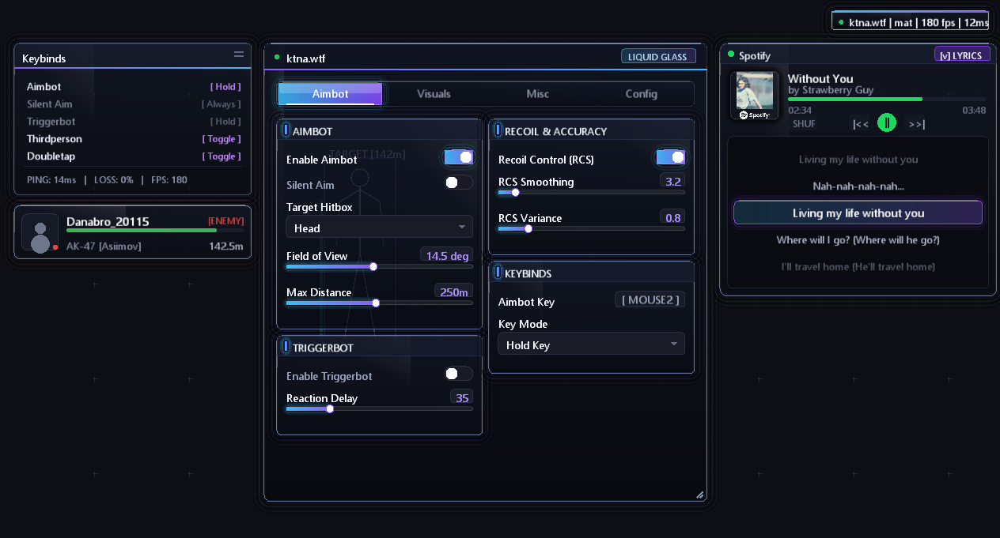

# ktna.wtf

standalone c++20 directx 11 immediate-mode gui and overlay engine. made this from scratch because imgui gets signature-scanned by basically every anti-cheat nowadays.

zero imgui dependencies, custom 24-byte vertex stride, compiles hlsl in-memory at runtime, built-in liquid glass theme, and live spotify synced lyrics using winrt + lrclib.



## why not just use imgui?

every public ac (eac, battleye, ricochet, ace, vanguard) scans memory for imgui signatures. the default 20-byte `ImDrawVert` stride, standard font textures, recognizable vtable layouts, and strings all get flagged.

ktna replaces the whole thing on bare direct3d 11:
- **zero imgui code**: completely custom immediate-mode architecture (`Context`, `DrawList`, `Widgets`, `Layout`).
- **24-byte vertex stride**: custom vertex geometry layout (`x, y, u, v, color, flags`) that breaks standard 20-byte `ImDrawVert` pattern scanners.
- **runtime in-memory hlsl compiler**: shaders are compiled in volatile memory via `D3DCompile` at runtime. zero `.cso` files or static bytecode on disk.
- **hardware font engine**: generates a crisp segoe ui texture atlas directly into an immutable d3d11 srv. no freetype or stb_truetype bloat.
- **14-point pipeline state save/restore**: full snapshot and restoration of host d3d11 state (viewports, scissor rects, blend states, depth-stencil, samplers, constant buffers, and shader instances) so the host game never crashes or glitches.
- **liquid glass mode**: frosted glass substrate, animated specular light sheen wave, and bevel rim catch-lights.
- **spotify widget + synced lyrics**: pulls live playback from windows smtc without tokens or dev accounts, decodes album art, and renders real-time synced lyrics from lrclib with millisecond timeline interpolation.
- **anti-capture external overlay**: built-in transparent overlay using `WDA_EXCLUDEFROMCAPTURE` so obs, discord screenshare, and anticheat screen captures see clean gameplay.

## imgui vs ktna

| feature | dear imgui | ktna.wtf |
| :--- | :--- | :--- |
| dependencies | third-party library | standalone c++20 |
| ac detection | sigged by basically everything | custom layout / no pub signatures |
| vertex stride | 20 bytes (`ImDrawVert`) | 24 bytes (`x, y, u, v, col, flags`) |
| shaders | static embedded bytecode | dynamic runtime in-memory hlsl |
| pipeline state | basic backup | 14-point d3d11 state save/restore |
| styling | flat / basic borders | liquid glass + live specular sheen |
| cards | manual child frames | auto-wrapping cards (zero dead space) |
| popups | clipped by parent window | unclipped floating popup layer |
| spotify / lyrics | none | built-in winrt smtc + synced lrclib |
| stream-proof | manual setup | built-in `WDA_EXCLUDEFROMCAPTURE` |

## repository structure

```
ktna/
├── include/
│   ├── void_types.hpp        # math (vec2, rect, color), vertex layout, theme
│   ├── void_font.hpp         # segoe ui font atlas & glyph metrics
│   ├── void_draw.hpp         # drawlist, vector primitives, glass shaders
│   ├── void_layout.hpp       # auto-wrapping cards, columns, drag containers
│   ├── void_widgets.hpp      # buttons, toggles, sliders, combos, keybinds
│   ├── void_popup.hpp        # floating unclipped dropdown manager
│   ├── void_gui.hpp          # context engine & ktna:: namespace
│   ├── void_gui_d3d11.hpp    # d3d11 backend & hlsl runtime compiler
│   ├── void_spotify.hpp      # winrt smtc media hook + synced lyrics
│   ├── void_playerbar.hpp    # target info hud widget
│   ├── void_overlay.hpp      # transparent borderless overlay window
│   └── void_hook.hpp         # dummy swapchain vmt resolver & detour
├── src/                      # engine implementations
├── demo/
│   └── main.cpp              # demo menu with esp, widgets, and spotify
├── media/
│   └── preview.png           # screenshot preview
├── build.bat                 # msvc build script
└── README.md
```

## integration

### 1. internal (dxgi present hook)

resolves the swapchain vtable using a throwaway dummy device so we never leak handles or query live game objects:

```cpp
#include "void_gui.hpp"
#include "void_gui_d3d11.hpp"
#include "void_hook.hpp"

// hook IDXGISwapChain::Present
HRESULT __stdcall Hook_Present(IDXGISwapChain* swap, UINT sync, UINT flags) {
    static bool init = false;
    static ktna::Context gui;

    if (!init) {
        ID3D11Device* dev = nullptr;
        ID3D11DeviceContext* ctx = nullptr;
        swap->GetDevice(__uuidof(ID3D11Device), (void**)&dev);
        dev->GetImmediateContext(&ctx);

        ktna::D3D11_Init(dev, ctx);
        init = true;
    }

    gui.NewFrame();
    ktna::D3D11_NewFrame();

    if (gui.Begin("ktna.wtf", ktna::Vec2(100, 100), ktna::Vec2(500, 450))) {
        static bool aimbot = true;
        gui.Toggle("enable aimbot", &aimbot);
        gui.End();
    }

    gui.Render();
    DXGI_SWAP_CHAIN_DESC desc;
    swap->GetDesc(&desc);
    ktna::D3D11_Render(gui.GetDrawList(), (float)desc.BufferDesc.Width, (float)desc.BufferDesc.Height);

    return Original_Present(swap, sync, flags);
}
```

> **rtss hook note**: on titles with aggressive code integrity (like fortnite/eac), hook rivatuner's osd render callback (`RTSSHooks64.dll`) instead of the game swapchain. rtss is signed and whitelisted by anti-cheats.

### 2. external (stream-proof overlay)

spins up a transparent borderless d3d11 window and calls `SetWindowDisplayAffinity(hwnd, WDA_EXCLUDEFROMCAPTURE)` so obs, discord screenshare, and anticheat bitblt grabs see clean gameplay:

```cpp
#include "void_overlay.hpp"
#include "void_gui.hpp"
#include "void_gui_d3d11.hpp"

int main() {
    if (!ktna::ExternalOverlay::Initialize("Target Game Window")) return 1;

    // hide from obs / discord / screen capture
    SetWindowDisplayAffinity(ktna::ExternalOverlay::GetOverlayHWND(), WDA_EXCLUDEFROMCAPTURE);

    ktna::Context gui;
    ktna::D3D11_Init(ktna::ExternalOverlay::GetDevice(), ktna::ExternalOverlay::GetContext());

    while (ktna::ExternalOverlay::ProcessMessages()) {
        ktna::ExternalOverlay::SyncWithTarget();
        ktna::ExternalOverlay::BeginFrame();

        gui.NewFrame();
        ktna::D3D11_NewFrame();

        // draw esp
        ktna::DrawList* dl = gui.GetDrawList();
        dl->AddRect(ktna::Vec2(200, 150), ktna::Vec2(260, 320), ktna::Color(139, 92, 246, 255), 2.0f);

        gui.Render();
        ktna::Vec2 screen = ktna::ExternalOverlay::GetScreenSize();
        ktna::D3D11_Render(gui.GetDrawList(), screen.x, screen.y);

        ktna::ExternalOverlay::EndFrame(true);
    }

    ktna::ExternalOverlay::Shutdown();
    return 0;
}
```

## ui usage

clean immediate-mode syntax:

```cpp
ktna::Context gui;
gui.NewFrame(dt);

if (gui.Begin("ktna.wtf", ktna::Vec2(334, 55), ktna::Vec2(560, 580))) {
    static int tab = 0;
    const char* tabs[] = { "aimbot", "visuals", "misc", "config" };
    gui.TabBar(tabs, 4, &tab);

    gui.Columns(2);

    // card height wraps children automatically
    gui.BeginCard("targeting");
    static bool aimbot = true;
    static float fov = 14.5f;
    static int hitbox = 0;
    const char* hitboxes[] = { "head", "neck", "chest", "pelvis" };

    gui.Toggle("enable aimbot", &aimbot);
    gui.Combo("hitbox", &hitbox, hitboxes, 4);
    gui.SliderFloat("fov", &fov, 1.0f, 30.0f, "%.1f deg");
    gui.EndCard();

    gui.NextColumn();

    gui.BeginCard("recoil");
    static bool rcs = true;
    static float smooth = 3.2f;
    gui.Toggle("rcs", &rcs);
    gui.SliderFloat("smoothing", &smooth, 1.0f, 25.0f, "%.1f");
    gui.EndCard();

    gui.EndColumns();
    gui.End();
}
```

## building

compile with msvc x64:

```cmd
cd void_gui
build.bat
```

or manually with `cl`:

```cmd
cl /std:c++20 /O2 /W3 /EHsc /MD /nologo /I"include" ^
   src\void_font.cpp src\void_draw.cpp src\void_layout.cpp src\void_widgets.cpp ^
   src\void_popup.cpp src\void_gui.cpp src\void_gui_d3d11.cpp src\void_overlay.cpp ^
   src\void_hook.cpp src\void_spotify.cpp src\void_playerbar.cpp demo\main.cpp ^
   /Fe:ktna_demo.exe ^
   /link user32.lib gdi32.lib d3d11.lib dxgi.lib d3dcompiler.lib dwmapi.lib WindowsApp.lib winhttp.lib /SUBSYSTEM:WINDOWS
```

## controls

- `insert`: open / close menu
- `f12`: save raw d3d11 backbuffer screenshot to `screenshot.bmp`
- `mouse wheel`: scroll synced lyrics / containers
- `left click + drag`: move menu / hud widgets around

## license

mit
